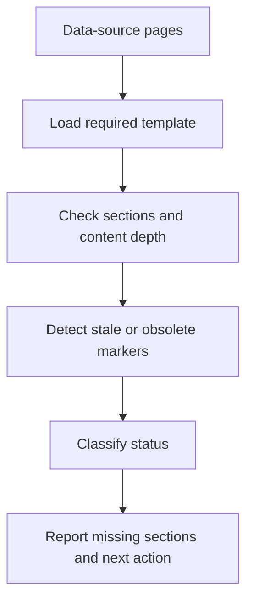

# Documentation Quality Police Skill


A focused documentation audit skill for analytics data-source pages. It checks whether documentation is complete, fresh, structured, and useful enough for analysts, engineers, and stakeholders to trust.

## Why It Matters

Data teams often have dashboards, pipelines, and documentation living at different quality levels. This skill turns documentation review into an operational check: each page receives a status, missing sections, weak sections, notes, and a practical next action.

| Business value | Technical value |
| --- | --- |
| Better trust in analytics assets | Template-based audit engine for data-source pages |
| Faster remediation planning | Status classification and missing-section detection |
| Clear governance across media or data domains | Engine-level grouping and structured outputs |
| Safer documentation updates | Preview-first alignment workflow |

## What It Can Do

- Audit documentation pages grouped by business engine or domain.
- Classify pages as `OK`, `Incomplete`, `Empty`, or `Outdated`.
- Detect missing or weak template sections.
- Generate practical next actions for documentation owners.
- Produce human-readable or JSON output for downstream automation.
- Preview template-alignment updates before applying changes.

## Audit Model



## Repository Structure

```text
.
|-- SKILL.md
|-- agents/openai.yaml
|-- references/data-domains-audit-standard.md
`-- scripts/prueba_police.py
```

## Example Commands

```bash
python3 scripts/prueba_police.py audit
python3 scripts/prueba_police.py --format json audit
python3 scripts/prueba_police.py audit --engine "Paid Media" --engine "Owned Media"
python3 scripts/prueba_police.py audit --page "Example Data Source"
python3 scripts/prueba_police.py align --dry-run
```

## Quality Dimensions

| Dimension | What it checks |
| --- | --- |
| Completeness | Required sections, useful explanations, key fields |
| Structure | Consistent heading order and template alignment |
| Freshness | Stale, obsolete, or deprecated content signals |
| Usefulness | KPIs, joins, grain, mappings, and data logic |
| Safety | Preview-first updates and preservation of useful context |

## Skills Demonstrated

`documentation QA`  -  `Confluence automation`  -  `data governance`  -  `Python scripting`  -  `quality scoring`  -  `structured reporting`  -  `AI operations design`

## Security

This is a sanitized showcase repository. It contains no Confluence tokens, tenant details, internal page IDs, or confidential documentation content.
