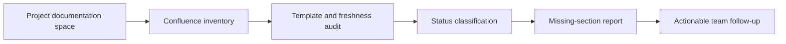
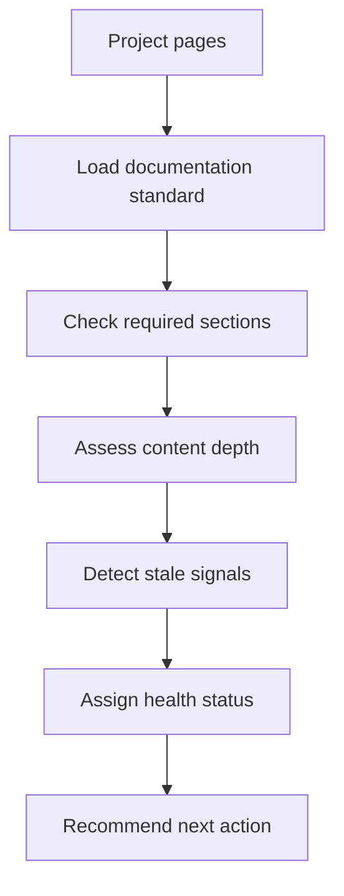

# Project Docs Health Monitor

> Helps delivery teams see which project pages are complete, stale, missing ownership, or blocking alignment before documentation debt becomes operational risk.


A Confluence documentation health monitor built to help a project team stay aligned, current, and accountable. It audits project documentation, flags stale or incomplete pages, checks template coverage, and produces a clear action list for documentation owners.

## Product Impact

In cross-functional analytics projects, documentation can become outdated faster than the actual delivery work. Requirements, data-source notes, business logic, ownership, and implementation details often live across multiple Confluence pages, making it hard to know whether the team is working from the latest version of the truth.

This workflow was created to turn documentation maintenance into a repeatable operational check.

| Team need | What the monitor provides |
| --- | --- |
| Know whether project documentation is up to date | Freshness and completeness checks |
| Keep pages aligned with a shared template | Required-section validation |
| Reduce manual review effort | Automated Confluence audit workflow |
| Make follow-up actionable | Status, missing sections, weak sections, and next action |
| Avoid risky bulk edits | Preview-first alignment workflow |

## Functional Flow

I built this to make sure the team I was working with stayed on top of the project documentation. The goal was not just to "clean pages", but to create visibility: which pages were complete, which were outdated, which were missing key sections, and where documentation owners needed to act.



## What It Can Do

- Audit Confluence pages grouped by workstream, engine, or documentation area.
- Classify pages as `OK`, `Incomplete`, `Empty`, or `Outdated`.
- Detect missing sections, thin content, weak sections, and obsolete markers.
- Generate human-readable or JSON reports for follow-up workflows.
- Preview template-alignment updates before applying changes.
- Preserve useful existing context instead of overwriting pages blindly.

## Workflow Detail



## Code And Installation

```text
.
|-- SKILL.md
|-- agents/openai.yaml
|-- references/data-domains-audit-standard.md
`-- scripts/prueba_police.py
```

## Example Commands

```bash
python3 scripts/prueba_police.py audit
python3 scripts/prueba_police.py --format json audit
python3 scripts/prueba_police.py audit --engine "Paid Media" --engine "Owned Media"
python3 scripts/prueba_police.py audit --page "Example Data Source"
python3 scripts/prueba_police.py align --dry-run
```

## Quality Dimensions

| Dimension | What it checks |
| --- | --- |
| Freshness | Stale, obsolete, deprecated, or outdated signals |
| Completeness | Required sections and minimum useful content |
| Structure | Heading order and template consistency |
| Usefulness | KPIs, joins, grain, mappings, data logic, and notes |
| Accountability | Clear status and practical next action |
| Safety | Preview-first updates and preservation of existing knowledge |

## Skills Demonstrated

`documentation governance` - `Confluence automation` - `project operations` - `Python scripting` - `quality scoring` - `structured reporting` - `team enablement`

## Public Scope

This public version contains no Confluence tokens, tenant details, internal page IDs, or confidential documentation content.
